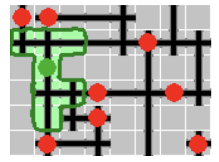

# Isolation

This repository contains solution to problem from Algorithms for Computationally Hard Problems class.

The problem posed is to place K people on a board representing a park with dimensions WxH,
so that every two people are at least L cells away (in Manhattan norm, counting only "path" cells).

There are two kinds of cells on board: "path" and "regular". People can be placed only on "path" cells.

The algorithm implemented is a heuristics that places people beginning with the cells that have the lowest coverage
score, defined as the number of "path" cells covered by a person on a given cell.

## Example of a solution

*(Source: home.agh.edu.pl/~faliszew/apto2020/)*
